**AWS Highly Available Web Application Project**
**Project Overview**

This project shows how to build a highly available and scalable web application on AWS using core AWS services.
The application runs on EC2 instances inside private subnets and is accessed through an Application Load Balancer.
Auto Scaling automatically manages EC2 instances based on load.
Amazon EFS is used for shared storage and Amazon S3 for object storage.

**Architecture Summary**

User requests come to the Application Load Balancer.
The load balancer forwards traffic to EC2 instances in private subnets.
Auto Scaling ensures the required number of EC2 instances are always running.
CloudWatch monitors performance and triggers scaling actions.

**AWS Services Used**

VPC, Subnets, Internet Gateway, NAT Gateway, Route Tables
EC2, Launch Template, Auto Scaling Group
Application Load Balancer, Target Group
IAM Role, Security Groups
CloudWatch
Amazon EFS, Amazon S3

**Implementation with Screenshots and Explanation**

**VPC**

A custom VPC was created with CIDR block 10.0.0.0/16.
All AWS resources in this project are deployed inside this VPC.

Screenshot Explanation:

This screenshot shows the custom VPC name, CIDR range, and DNS settings enabled.

**Subnets**

Two public subnets and two private subnets were created across multiple Availability Zones.
Public subnets are used for the load balancer.
Private subnets are used for EC2 instances.

Screenshot Explanation:
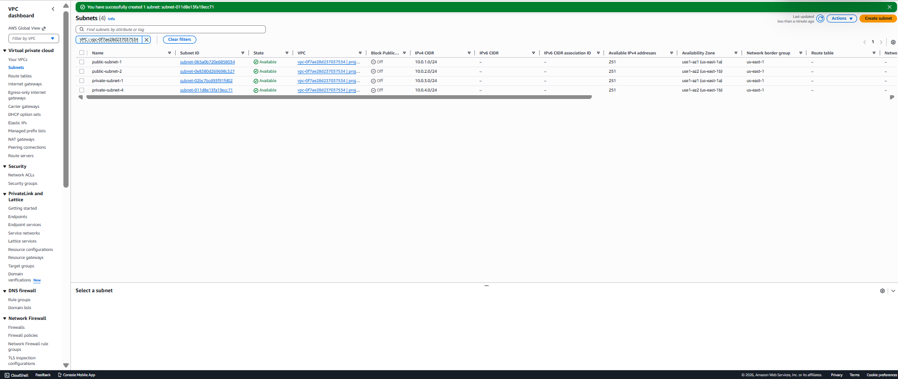

This screenshot shows the subnet names, CIDR blocks, and Availability Zones.

**Internet Gateway**

An Internet Gateway was attached to the VPC.
This allows internet access for resources in public subnets.

Screenshot Explanation:
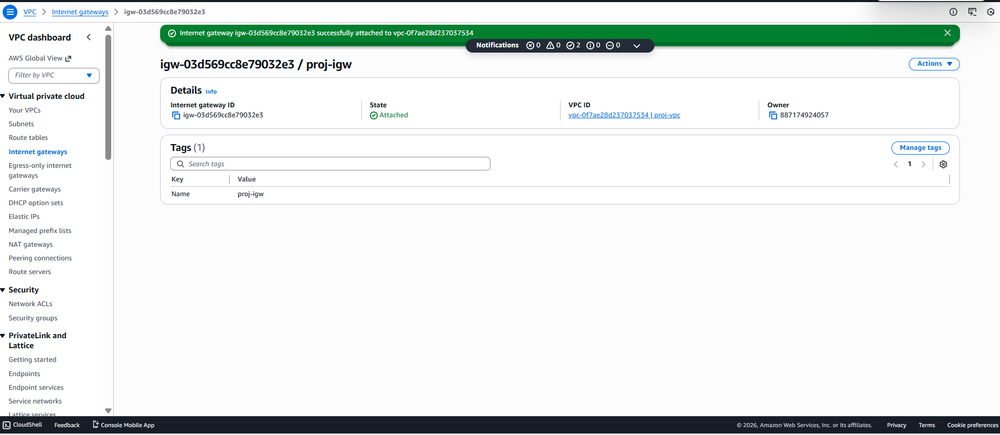

This screenshot confirms the Internet Gateway is attached to the correct VPC.

**Route Tables**

Public route table sends traffic to the Internet Gateway.
Private route table sends traffic to the NAT Gateway.

Screenshot Explanation:

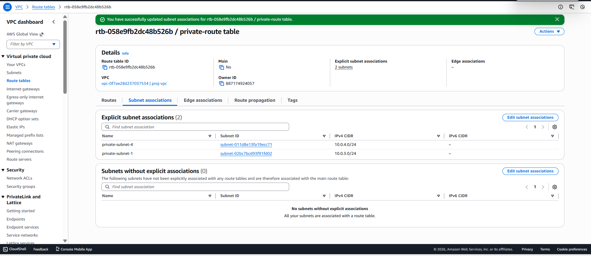

These screenshots show routing rules (0.0.0.0/0) and subnet associations.

**Security Groups**

Separate security groups were created for ALB, EC2, and EFS.
This follows the principle of least privilege.

Screenshot Explanation:
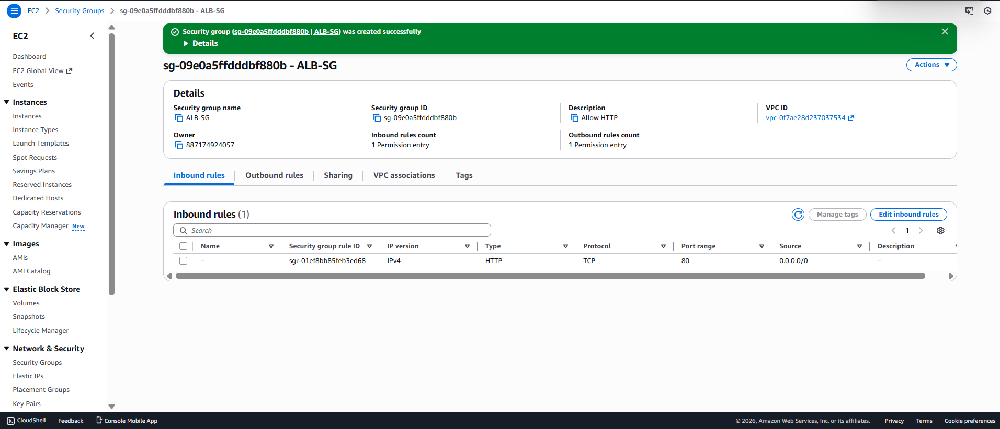
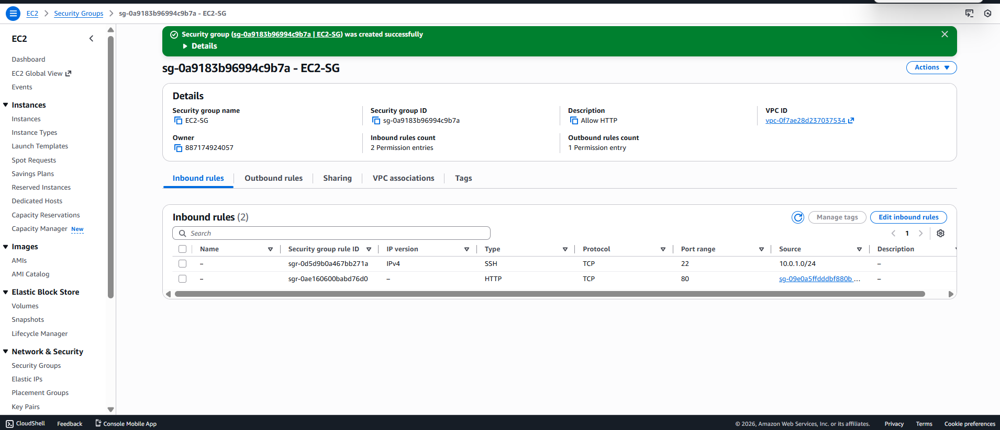

The screenshots show inbound rules allowing only required ports such as HTTP (80) and NFS (2049).

**IAM Role**

An IAM role was attached to EC2 instances.
This allows EC2 to access S3 and CloudWatch without storing access keys.

Screenshot Explanation:
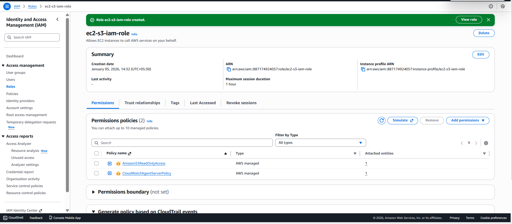
The screenshot shows the IAM role name and attached policies.

**Launch Template**

A launch template was created to define EC2 configuration.
Apache is installed automatically using user data.

Screenshot Explanation:

The screenshot shows AMI, instance type, security group, and IAM role configuration.

**Auto Scaling Group**

The Auto Scaling Group manages EC2 instances automatically.
Minimum is 1, desired is 2, and maximum is 4 instances.

Screenshot Explanation:

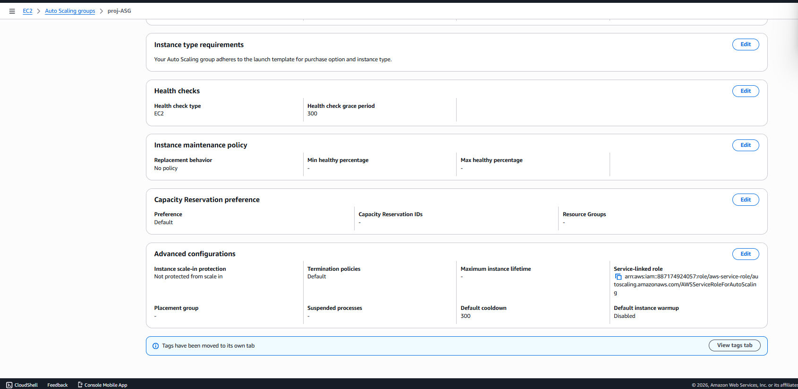
These screenshots show scaling configuration, instance count, and Availability Zones.

**EC2 Instances**

EC2 instances are launched automatically by the Auto Scaling Group.
They do not have public IP addresses.

Screenshot Explanation:
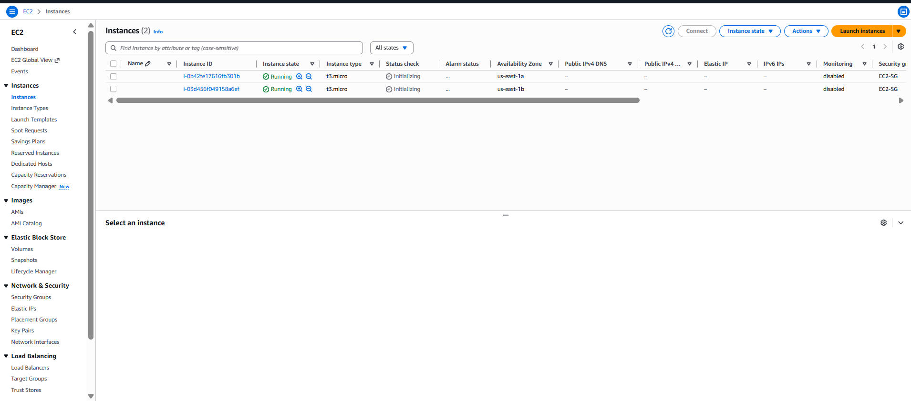
The screenshot shows running EC2 instances created by Auto Scaling.

**Target Group**

A target group was created to register EC2 instances.
Health checks are configured on port 80.

Screenshot Explanation:
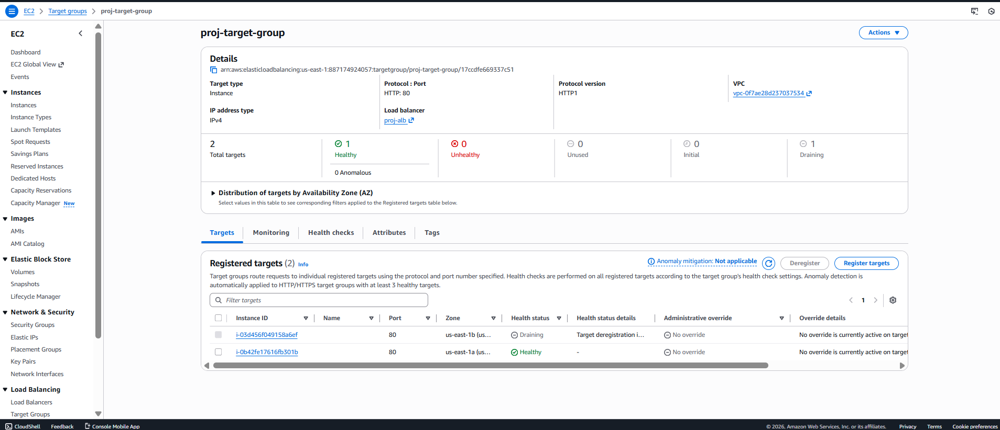
The screenshot shows healthy EC2 targets registered in the target group.

**Application Load Balancer**

The Application Load Balancer distributes incoming traffic to healthy EC2 instances.

Screenshot Explanation:

This screenshot shows the Apache web page accessed using the ALB DNS name.

**CloudWatch Monitoring**

CloudWatch monitors CPU utilization of EC2 instances.
Scaling actions are triggered based on CPU usage.

Screenshot Explanation:
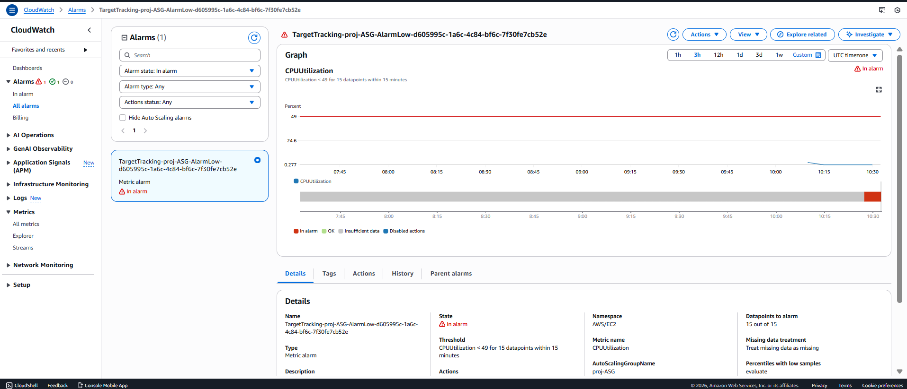
The screenshot shows the target tracking scaling policy and CPU metric.

**Amazon S3**

An S3 bucket was created for object storage.
Access is controlled using IAM roles.

Screenshot Explanation:

The screenshot shows the S3 bucket name and configuration.

**Amazon EFS**

EFS provides shared storage for all EC2 instances.
Data remains available even when instances are replaced.

Screenshot Explanation:
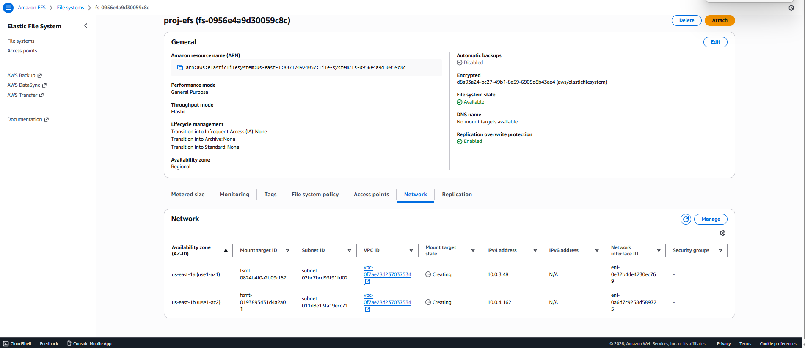
The screenshot shows the EFS file system and mount targets.

**Final Outcome**

The application is highly available and scalable.
EC2 instances scale automatically based on demand.
Security is handled using IAM roles and security groups.
Shared and object storage are implemented using EFS and S3.
